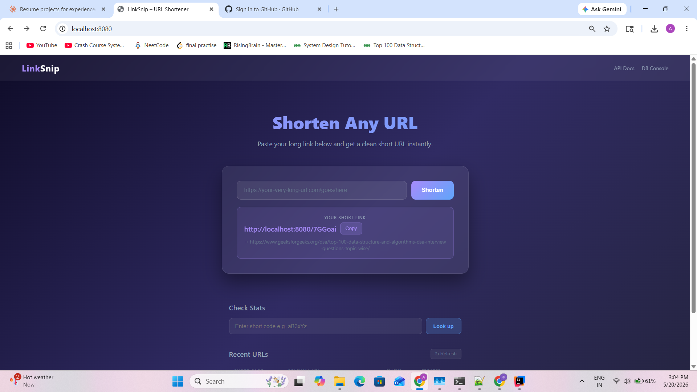

# LinkSnip — URL Shortener


A production-quality URL shortener built with **Java 17**, **Spring Boot 3**, **MySQL**, and **Docker**.
Clean architecture, atomic click tracking, thread-safe code generation, and full test coverage.

---

## Live Demo

> Run locally in under 2 minutes — see [Getting Started](#getting-started)
> 

| Feature | URL |
|---|---|
| Web UI | `http://localhost:8080` |
| Swagger API Docs | `http://localhost:8080/swagger-ui/index.html` |
| DB Console (H2 test) | `http://localhost:8080/h2-console` |

---

## Features

- Shorten any URL to a 6-character alphanumeric code
- Redirect with **atomic click count tracking** (thread-safe, no race conditions)
- Per-URL stats — click count, creation date, original URL
- MySQL running in Docker — zero manual DB setup
- Swagger UI — fully documented REST API
- 17 unit tests across service, controller, and repository layers
- Input validation — rejects malformed URLs before they hit the DB

---

## Tech Stack

| Layer | Technology | Why |
|---|---|---|
| Language | Java 17 | LTS, records, sealed classes |
| Framework | Spring Boot 3.2.5 | Auto-configuration, embedded Tomcat |
| Database | MySQL 8.0 (Docker) | Persistent, production-grade |
| ORM | Spring Data JPA + Hibernate 6 | Clean repository pattern |
| Validation | Jakarta Validation | Declarative input guards |
| API Docs | SpringDoc OpenAPI (Swagger UI) | Auto-generated, always up to date |
| Testing | JUnit 5 + Mockito + MockMvc | Unit + slice tests, no flakiness |
| Build | Maven 3.9 | Multi-module ready |
| Container | Docker | Reproducible local infra |

---

## Getting Started

### Prerequisites
- Java 17+
- Maven 3.6+
- Docker Desktop

### 1. Clone the repo
```bash
git clone https://github.com/YOUR_USERNAME/url-shortener.git
cd url-shortener
```

### 2. Start MySQL in Docker
```bash
docker run --name mysql-urlshortener \
  -e MYSQL_ROOT_PASSWORD=root123 \
  -e MYSQL_DATABASE=urlshortenerdb \
  -p 3306:3306 -d mysql:8.0
```

### 3. Run the app
```bash
mvn spring-boot:run
```

### 4. Open the UI
```
http://localhost:8080
```

That's it. No manual DB setup, no config changes needed.

---

## API Reference

### POST `/api/shorten` — Shorten a URL
```bash
curl -X POST http://localhost:8080/api/shorten \
  -H "Content-Type: application/json" \
  -d '{"url": "https://www.google.com/search?q=spring+boot"}'
```
**Response:**
```json
{
  "shortCode": "aB3xYz",
  "shortUrl": "http://localhost:8080/aB3xYz",
  "originalUrl": "https://www.google.com/search?q=spring+boot"
}
```

---

### GET `/{shortCode}` — Redirect
```bash
curl -L http://localhost:8080/aB3xYz
# → 302 redirect to original URL
# → click count incremented atomically
```

---

### GET `/api/stats/{shortCode}` — Get Stats
```bash
curl http://localhost:8080/api/stats/aB3xYz
```
**Response:**
```json
{
  "shortCode": "aB3xYz",
  "shortUrl": "http://localhost:8080/aB3xYz",
  "originalUrl": "https://www.google.com/search?q=spring+boot",
  "clickCount": 42,
  "createdAt": "2026-05-20T14:24:31"
}
```

---

### GET `/api/urls` — List All URLs
```bash
curl http://localhost:8080/api/urls
```

---

## Project Structure

```
src/
├── main/
│   ├── java/com/urlshortener/
│   │   ├── UrlShortenerApplication.java     # Entry point
│   │   ├── controller/
│   │   │   └── UrlShortenerController.java  # REST endpoints
│   │   ├── service/
│   │   │   └── UrlShortenerService.java     # Business logic
│   │   ├── entity/
│   │   │   └── UrlMapping.java             # JPA entity
│   │   └── repository/
│   │       └── UrlMappingRepository.java    # DB queries
│   └── resources/
│       ├── application.properties           # Config
│       └── static/index.html               # Web UI
└── test/
    └── java/com/urlshortener/
        ├── controller/
        │   └── UrlShortenerControllerTest.java  # MockMvc tests
        ├── service/
        │   └── UrlShortenerServiceTest.java     # Mockito tests
        └── repository/
            └── UrlMappingRepositoryTest.java    # DataJpaTest slice
```

---

## System Design Decisions

### Short Code Generation
Using `SecureRandom` with 6 alphanumeric characters gives **62⁶ ≈ 56 billion** possible codes.
A collision retry loop regenerates the code if it already exists:

```java
private final SecureRandom secureRandom = new SecureRandom();

private String generateUniqueCode() {
    String code;
    do {
        // generate 6-char code
    } while (repository.existsByShortCode(code)); // retry on collision
    return code;
}
```

**At scale:** Replace the retry loop with a pre-generated code pool stored in Redis,
or use a distributed ID generator (e.g. Twitter Snowflake) to eliminate DB round-trips.

---

### Atomic Click Tracking
Click count increments use a **single atomic SQL UPDATE** — not read-then-write:

```sql
UPDATE url_mappings SET click_count = click_count + 1 WHERE short_code = ?
```

This avoids race conditions when multiple users click the same short URL simultaneously.
A read-then-write approach would lose increments under concurrent load.

**At scale:** Move click tracking to an async queue (Kafka). Write click events to the queue,
batch-insert to DB every few seconds. Decouples the redirect hot path from DB write pressure.

---

### Read / Write Separation
Two separate service methods — `getOriginalUrl()` and `getStats()`:

- `getOriginalUrl()` — **transactional write**, increments click count. Called by redirect.
- `getStats()` — **read-only transaction**, never increments. Called by stats endpoint.

This separation matters: the redirect endpoint is latency-critical and write-heavy.
The stats endpoint is read-only and can be cached independently.

---

### Indexing
`short_code` has a `UNIQUE` constraint which creates a B-tree index automatically.
Every redirect does a lookup by `short_code` — this is the hottest DB query in the system.

**At scale:** Add a Redis cache layer. Cache `shortCode → originalUrl` for the top 20% of URLs
that receive ~80% of traffic (Pareto principle). Cache hit rate would be very high for viral links.

---

### URL Routing Guard
The redirect route uses a regex to prevent catching static resources:

```java
@GetMapping("/{shortCode:[a-zA-Z0-9]{6}}")
```

This ensures `/index.html`, `/favicon.ico`, and `/swagger-ui` are never intercepted by the redirect controller.

---

## Running Tests

Tests use **H2 in-memory DB** — no Docker needed to run the test suite:

```bash
mvn test
```

**17 tests across 3 layers:**

| Test Class | Count | What's Covered |
|---|---|---|
| `UrlShortenerServiceTest` | 8 | shortenUrl, redirect increments click, stats is read-only, collision retry |
| `UrlShortenerControllerTest` | 9 | All endpoints, 400 validations, 302 redirect, 404 handling |
| `UrlMappingRepositoryTest` | 7 | findByShortCode, incrementClickCount atomicity, unique constraint |

---

## What I'd Add at Scale

| Concern | Solution |
|---|---|
| High redirect throughput | Redis cache for `shortCode → URL` |
| Click tracking at scale | Async Kafka queue, batch DB writes |
| Code generation at scale | Pre-generated pool in Redis |
| Multiple regions | Read replicas for MySQL |
| URL expiry | `expires_at` column + scheduled cleanup job |
| Custom aliases | Allow users to set their own short code |
| Analytics dashboard | Per-URL referrer, device, geo breakdown |

---


